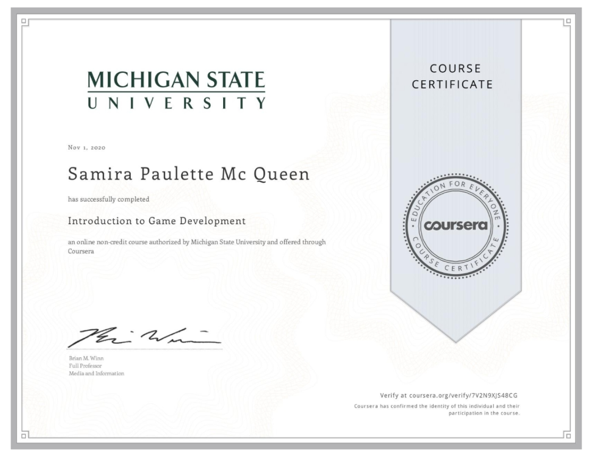

# Introduction to Game Development
This project was done in my Coursera Specialization Course
# Solar System
First time using Unity. Solar System Project showing the moon and four planets rotating around the sun.
# About the Author
Name: Samira Mc Queen
[LinkedIn](https://www.linkedin.com/in/samira-mc-queen-1882431a7/)

Free Spririted Caribbean Woman.
Software Developer and aspiring Game Developer

# Project 

## Experience with Project
- This was my 1st project while doing the course and i've been loving it
- Creating this project was simple there's not many features and was an introduction to the platform Unity and it's tools

# Game Features
- The planets rotate around the sun, while the moon rotates around the planets

# Language
- C Sharp

# Platform
- Unity

# Game Play
First download the repository locally on your device
- For Mac go to this part of the project and run the game 
``
(box-shooter/Build/Mac/Mac-Build.app/)
``

Enjoy! :) 
